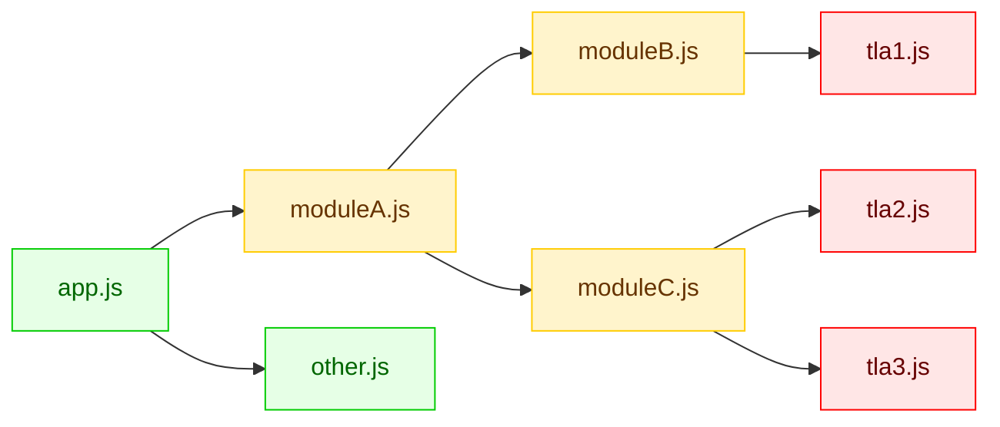

> [!Warning]
> This plugin is currently in development. A filter option will be added soon. For more information, see [this issue](https://github.com/zOadT/concurrent-top-level-await-plugins/issues/35).

# rolldown-plugin-concurrent-top-level-await

Rolldown (and therefore also Vite) will change the behavior of modules containing top level await (TLA):
they run sequentially instead of concurrently, as described in
[the Rolldown docs](https://github.com/rolldown/rolldown/blob/main/docs/in-depth/tla-in-rolldown.md).
This Vite-compatible plugin enables concurrent execution of TLA modules.

Note that this plugin requires TLA support at runtime; it does _not_ provide a TLA polyfill.
For that, check out [vite-plugin-top-level-await](https://www.npmjs.com/package/vite-plugin-top-level-await).

<!-- ### Evaluation Order

The evaluation order closely matches V8's behavior according to [tla-fuzzer](https://github.com/evanw/tla-fuzzer).
Minor deviations can still occur though.

| Variant                  | Rollup | Rollup with Plugin |
| ------------------------ | ------ | ------------------ |
| Simple                   | 80%    | 99%                |
| Trailing Promise         | 10%    | 99%                |
| Cyclic                   | 69%    | 99%                |
| Cyclic, Trailing Promise | 15%    | 99%                | -->

## Installation

Using npm:

```bash
npm install rolldown-plugin-concurrent-top-level-await --save-dev
```

## Usage

```ts
import concurrentTopLevelAwait from "rolldown-plugin-concurrent-top-level-await";

export default defineConfig({
	experimental: { nativeMagicString: true },
	plugins: [concurrentTopLevelAwait()],
});
```

## Options

| Option                    | Type     | Default   | Description                                                                                                               |
| ------------------------- | -------- | --------- | ------------------------------------------------------------------------------------------------------------------------- |
| `generatedVariablePrefix` | `string` | `"__tla"` | Prefix used for internal variables generated by the plugin. Change this if it conflicts with variable names in your code. |

### Which modules to include?

The plugin needs to handle not only modules that directly contain a top-level `await`, but also their ancestor modules up to the lowest common ancestor. Ancestor modules must be transformed to handle the asynchronous completion of their children concurrently. If an ancestor module is not transformed, its direct dependencies will become blocking and therefore alter the evaluation order.

Consider the following module structure as an example:



If the red modules contain top level awaits, these and their yellow ancestors should be included in the plugin's `include` option.

## Known Limitations

### Circular Dependencies

There is a known issue where modules in a circular dependency don't get executed.

### Evaluation Order

As can be seen in the table above, the plugin does not guarantee 100% matching of V8's evaluation order, although the deviations should be pretty minor in practice. If you encounter significant deviations, please open an issue.

Additionally, some scenarios are known to cause deviations, e.g. when the [`include` option is not correctly configured](#which-modules-to-include) or when there is a dependency cycle that is split across multiple chunks.

### Build Performance

To transform a module, the plugin needs to check if any of its dependencies is async. Hence, the transformation is
postponed until the subgraph is analyzed. This may lead to slower builds.

If you notice significant performance degradation, please open an issue.

### Exposed Module Structure

Because the execution of modules gets wrapped in functions, the bundled output will contain more information about the source module structure. This may be a consideration for projects where code obfuscation is important.

### Tree Shaking

Wrapping code in functions may reduce tree shaking effectiveness. We mitigate this where possible, such as by not wrapping declarations.

### Changing Variable Types

In the process of transforming the code, top level `const` declarations may get replaced with `let` declarations. This
can lead to `const` variables being assignable at runtime instead of throwing an invalid assignment error.

Additionally, variable declarations may be hoisted, which removes temporal dead zone (TDZ) checks.

### Default export class name

When using `export default class {}`, the runtime `.name` of the exported value will be `<generatedVariablePrefix>_default` (e.g. `__tla_default`) instead of `default`.
