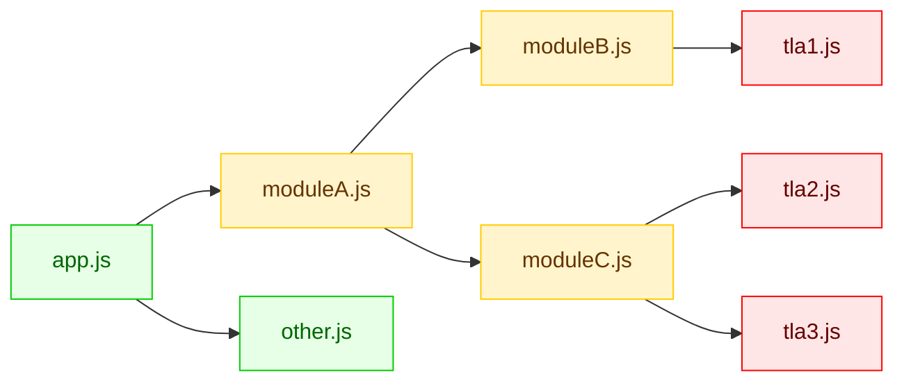

# rollup-plugin-concurrent-top-level-await

Rollup (and therefore also Vite) will change the behavior of modules containing top level await (TLA):
they run sequentially instead of concurrently, as described in
[the Rolldown docs](https://github.com/rolldown/rolldown/blob/main/docs/in-depth/tla-in-rolldown.md).
This Vite-compatible plugin enables concurrent execution of TLA modules.

Note that this plugin requires TLA support at runtime; it does _not_ provide a TLA polyfill.
For that, check out [vite-plugin-top-level-await](https://www.npmjs.com/package/vite-plugin-top-level-await).

## Installation

Using npm:

```bash
npm install rollup-plugin-concurrent-top-level-await --save-dev
```

## Usage

```ts
import concurrentTopLevelAwait from "rollup-plugin-concurrent-top-level-await";

export default {
	plugins: [
		concurrentTopLevelAwait({
			include: "**/*.js",
		}),
	],
};
```

## Options

| Option                    | Type            | Default     | Description                                                                                                                       |
| ------------------------- | --------------- | ----------- | --------------------------------------------------------------------------------------------------------------------------------- |
| `include`                 | `FilterPattern` | `undefined` | A pattern specifying which files to include. See [below](#which-modules-to-include) to determine which modules to include.        |
| `exclude`                 | `FilterPattern` | `undefined` | A pattern specifying which files to exclude. Must still follow the [same considerations](#which-modules-to-include) as `include`. |
| `sourceMap`               | `boolean`       | `true`      | Whether to generate source maps for transformed files.                                                                            |
| `generatedVariablePrefix` | `string`        | `"__tla"`   | Prefix used for internal variables generated by the plugin. Change this if it conflicts with variable names in your code.         |

### Which modules to include?

The plugin needs to handle not only modules that directly contain a top-level `await`, but also their ancestor modules up to the lowest common ancestor. Ancestor modules must be transformed to handle the asynchronous completion of their children concurrently. As an example, consider the following module structure:



If the red modules contain top level awaits, these and their yellow ancestors should be included in the plugin's `include` option.

## Known Limitations

### Execution Order

We currently prioritize minimizing the required code transformations over complete compliance with the standard.
As a result, the execution order of TLA modules may differ from the standard behavior in certain cases, as can be seen
by the results for [tla-fuzzer](https://github.com/evanw/tla-fuzzer):

| Variant                  | Rollup | Rollup with Plugin |
| ------------------------ | ------ | ------------------ |
| Simple                   | 80%    | 100%               |
| Trailing Promise         | 10%    | 94%                |
| Cyclic                   | 69%    | 77%                |
| Cyclic, Trailing Promise | 15%    | 64%                |

Please do not rely on a specific execution order when using this plugin.

We might adapt Webpack's approach in the future to improve correctness.

### Build Performance

To transform a module, the plugin needs to check if any of its dependencies is async. Hence, the transformation is
postponed until the subgraph is analyzed. This may lead to slower builds.

If you notice significant performance degradation, please open an issue.

### Exposed Module Structure

Because the execution of modules gets wrapped in functions, the bundled output will contain more information about the source module structure. This may be a consideration for projects where code obfuscation is important.

### Tree Shaking

Wrapping code in functions may reduce tree shaking effectiveness. We mitigate this where possible, such as by not wrapping declarations.

### Changing Variable Types

In the process of transforming the code, top level `const` declarations may get replaced with `let` declarations. This
can lead to `const` variables being assignable at runtime instead of throwing an invalid assignment error.

Additionally, variable declarations may be hoisted, which removes temporal dead zone (TDZ) checks.

## Default export class name

When using `export default class {}`, the runtime `.name` of the exported value will be `<generatedVariablePrefix>_default` (e.g. `__tla_default`) instead of `default`.
